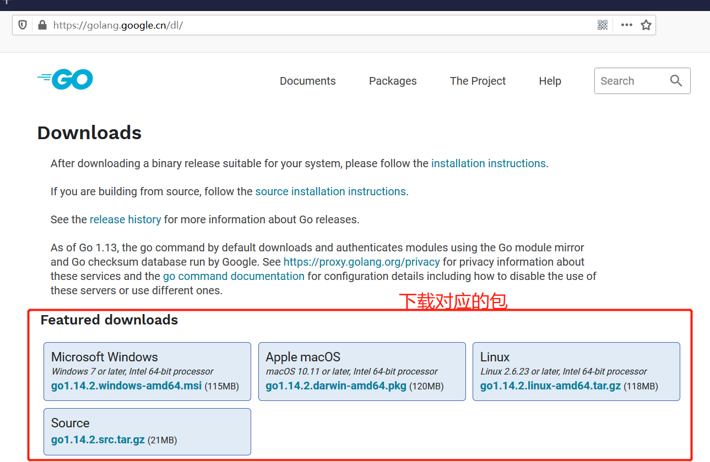
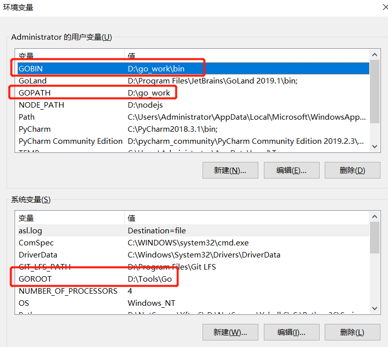
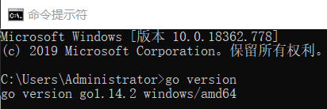

# README

### Go包安装

访问官网下载https://golang.google.cn/dl/

> 点击会弹出文件需要保存

在任意磁盘下创建go_work文件夹，并创建对应文件

~~~
├─ go_work  -- 代码根目录
│  ├─ bin
│  ├─ pkg
│  ├─ src
~~~

> **bin**：存放编译后可执行的文件
>
> **pkg**：编译时生成的中间文件
>
> **src**：存放应用源代码

然后打开下载的文件，下一步下一步即可

### 配置环境变量

配置这三个，如果新版本自动配好了就不用再配

打开cmd，输入go version如果有响应，则表示配置成功

### 编译器

我用的JetBrians，破解方法网上有