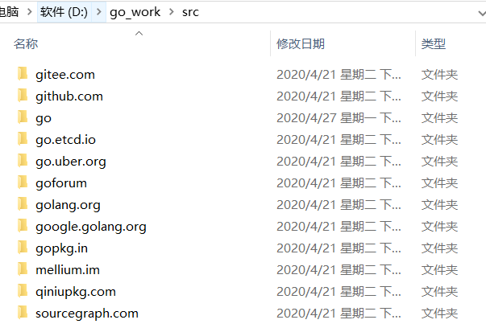
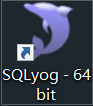
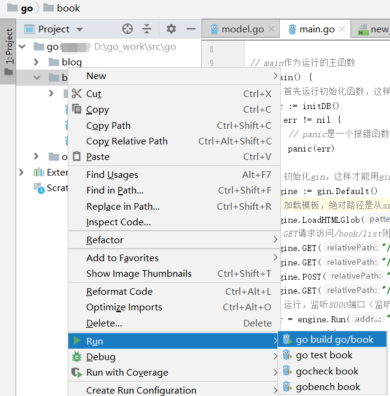

# README

### gin的安装

官方文档https://github.com/gin-gonic/gin

在cmd执行

~~~cmd
$ go get -u github.com/gin-gonic/gin
~~~

> 由于设计依赖包等，导致下载过慢或者失败的可以直接去下载整个包然后覆盖到自己的src里，如下图：
>
> 
>
> 百度网盘上传中...

同时你也可以下载数据库管理工具，然后连到自己的mysql数据库

### book项目

> 学习操作数据库响应页面点击等

整个项目拉下来，右键run整个目录即可

