## gin基础操作

### 网页交互

安装

~~~
$ go get -u github.com/gin-gonic/gin
~~~

#### 写一个Hello World

~~~go
package main

import (
	"fmt"
	"github.com/gin-gonic/gin"
	"net/http"
)

func main()  {
	// 1.创建路由
	router := gin.Default()
	// 2.绑定路由函数
	router.GET("/", func(c *gin.Context) {
		c.String(http.StatusOK, "Hello World")
	})
	// 3.运行
	err := router.Run(":8000")
	// 4.对报错做处理
	if err != nil{
		fmt.Println(err)
	}
}
~~~

运行并访问localhost:8000

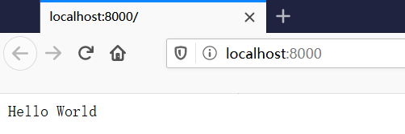

#### API参数

> 通过localhost:8000/user/ben访问

~~~go
package main

import (
	"fmt"
	"github.com/gin-gonic/gin"
	"net/http"
)

func main()  {
	// 1.创建路由
	router := gin.Default()
	// 2.绑定路由函数，声明一个name参数
	router.GET("/user/:name", func(c *gin.Context) {
		// 2.1 获取name的值
		param := c.Param("name")
		// 2.2 打印出来
		c.String(http.StatusOK, param)
	})
	// 3.运行
	err := router.Run(":8000")
	// 4.对报错做处理
	if err != nil{
		fmt.Println(err)
	}
}
~~~

> 导入包一致，所以不再全部写出来，运行并访问

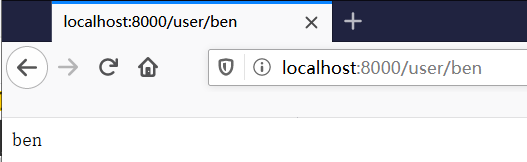

> 访问输入的name

gin提供*，处理更多参数

~~~go
func main()  {
	// 1.创建路由
	router := gin.Default()
	// 2.绑定路由函数，声明一个name参数
	router.GET("/user/:name/*active", func(c *gin.Context) {
		// 2.1 获取name的值
		name := c.Param("name")
		param := c.Param("active")
		// 2.2 打印出来
		c.String(http.StatusOK, name+param)
	})
	// 3.运行
	err := router.Run(":8000")
	// 4.对报错做处理
	if err != nil{
		fmt.Println(err)
	}
}
~~~

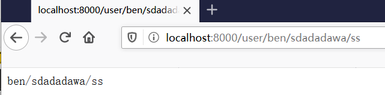

> 有了*后，可以无限写后面的内容

也可以设置默认值

~~~go
func main()  {
	// 1.创建路由
	router := gin.Default()
	// 2.绑定路由函数，声明一个name参数
	router.GET("/user", func(c *gin.Context) {
		// 2.1 获取name的值，并设置默认参数
		name := c.DefaultQuery("name","ben")
		// 2.2 打印出来
		c.String(http.StatusOK, name)
	})
	// 3.运行
	err := router.Run(":8000")
	// 4.对报错做处理
	if err != nil{
		fmt.Println(err)
	}
}
~~~

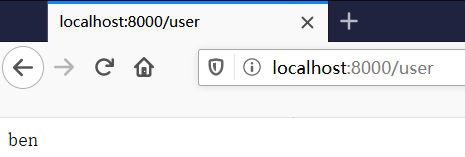

> 不加name直接使用路径，返回默认值

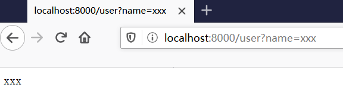

> 加了?name=xxx则返回xxx

表单参数

> PostForm()方法可以获取表单参数，默认解析的是from-data和x-www-form-urlencoded格式的参数

~~~go
func main()  {
	// 1.创建路由
	router := gin.Default()
	// 2.绑定路由函数，声明一个name参数
	router.POST("/form", func(c *gin.Context) {
		// 2.1 获取值
		//c.DefaultPostForm("xxx", "111")  // 表单也能设置默认值
		username := c.PostForm("username")
		password := c.PostForm("password")
		// 2.2 打印出来
		c.String(http.StatusOK, fmt.Sprintf("username:%s password:%s", username,password))
	})
	// 3.运行
	err := router.Run(":8000")
	// 4.对报错做处理
	if err != nil{
		fmt.Println(err)
	}
}
~~~

~~~html
<!DOCTYPE html>
<html lang="en">
<head>
    <meta charset="UTF-8">
    <title>登录</title>
</head>
<body>
    <form action="http://127.0.0.1:8000/form" method="post" enctype="application/x-www-form-urlencoded">
        用户名：<input type="text" name="username">
        密码：<input type="password" name="password">
        <input type="submit" value="登录">
    </form>
</body>
</html>
~~~

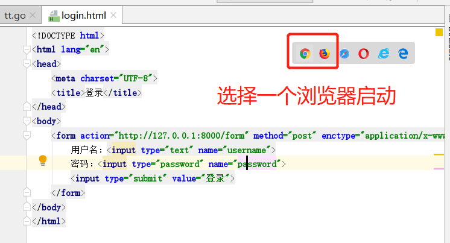

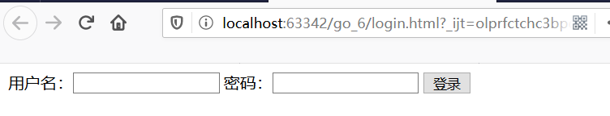

> 输入用户名密码并提交

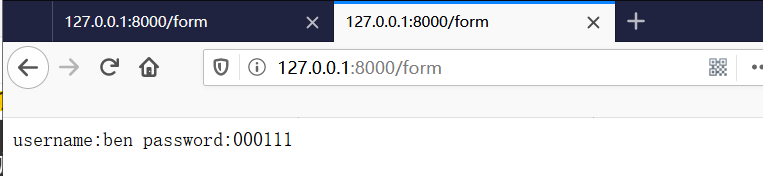

#### 上传文件

> multipart/form-data格式用于文件上传

~~~go
func main()  {
	// 1.创建路由
	router := gin.Default()
	// 2.绑定路由函数，声明一个name参数
	router.POST("/upload", func(c *gin.Context) {
		// 2.1 获取信息
		file, _ := c.FormFile("file")
		// 2.2 打印出来
		fmt.Println(file.Filename)
		// 2.3 保存文件到一个地方
		_ = c.SaveUploadedFile(file, "D://"+file.Filename)
		// 2.4 打印成功信息
		c.String(http.StatusOK, fmt.Sprintf("%s is Successed", file.Filename))
	})
	// 3.运行
	err := router.Run(":8000")
	// 4.对报错做处理
	if err != nil{
		fmt.Println(err)
	}
}
~~~

~~~html
<!DOCTYPE html>
<html lang="en">
<head>
    <meta charset="UTF-8">
    <title>文件上传</title>
</head>
<body>
    <form action="http://127.0.0.1:8000/upload" method="post" enctype="multipart/form-data">
        文件：<input type="file" name="file"> 
        <input type="submit" value="提交">
    </form>
</body>
</html>
~~~

上传多个文件

~~~go
func main()  {
	// 1.创建路由
	router := gin.Default()
	// 2.绑定路由函数，声明一个name参数
	router.POST("/upload", func(c *gin.Context) {
		// 2.1 获取信息
		form, err := c.MultipartForm()
		if err != nil{
			return
		}
		// 获取所有文件
		files := form.File["files"]
		for _,file := range files{
			if err := c.SaveUploadedFile(file, "D://"+file.Filename); err!=nil{
				c.String(http.StatusBadRequest, fmt.Sprintf("upload file err"))
				return
			}
		}
		c.String(http.StatusOK, fmt.Sprintf("Successed"))
	})
	// 3.运行
	err := router.Run(":8000")
	// 4.对报错做处理
	if err != nil{
		fmt.Println(err)
	}
}
~~~

~~~html
<!DOCTYPE html>
<html lang="en">
<head>
    <meta charset="UTF-8">
    <title>文件上传</title>
</head>
<body>
    <form action="http://127.0.0.1:8000/upload" method="post" enctype="multipart/form-data">
        文件：<input type="file" name="files" multiple> 
        <input type="submit" value="提交">
    </form>
</body>
</html>
~~~

#### routers.gourp

> 业务上会有很多路由，所有需要用组来管理

~~~go
func main()  {
	// 1.创建路由
	router := gin.Default()
	// 2.定义GET路由组，处理GET请求
	v1 := router.Group("/v1")
	// 在该组瞎，创建外卖需要的方法
	{
		v1.GET("/login",login)  //下面定义对应的方法
		v1.GET("/submit",submit)
		v1.GET("/read",read)
	}
	// 定义POST路由组，处理POST请求
	{
		v1.POST("/login",login)  //下面定义对应的方法
		v1.POST("/submit",submit)
		v1.POST("/read",read)
	}
	// 3.运行
	err := router.Run(":8000")
	// 4.对报错做处理
	if err != nil{
		fmt.Println(err)
	}
}

func login(c *gin.Context)  {
	name := c.DefaultQuery("name", "ben")
	c.String(http.StatusOK, name)
}

func submit(c *gin.Context)  {
}

func read(c *gin.Context)  {
}
~~~

gin底层用tree的形式做路由

### 数据解析和绑定

#### json数据解析和绑定

客户端传参，后端解析到结构体

~~~go
package main

import (
	"github.com/gin-gonic/gin"
	"net/http"
)

// 定义个结构体
// curl 传用户名和密码，被后端验证
type Login struct {
	// 接收json(或者form等)格式数据，binding表示username是必带的，否则报错
	Username string `json:"username" form:"username" uri:"username" binding:"required"`
	Password string `json:"password" binding:"required"`
}
func main()  {
	router := gin.Default()
	// json数据绑定
	router.POST("/loginJSON", func(c *gin.Context) {
		// 用于接收数据的结构体
		var json Login
		// 反序列化进来肯定是传的地址 &，并判断是否报错
		if err := c.ShouldBindJSON(&json); err != nil{
			// 报错的时候用json返回，用gin.H（封装生产json数据的工具）
			c.JSON(http.StatusBadRequest, gin.H{"error":err.Error()})
		}
		// 数据到这，成功绑定到结构体，判断账户密码是否正确
		if json.Username != "root"||json.Password!="123456"{
			c.JSON(http.StatusUnauthorized, gin.H{"status":"400"})
			return
		}
		// 登录成功
		c.JSON(http.StatusOK, gin.H{"status":"200"})
	})
	// 跑起来
	_ = router.Run(":8000")
}
~~~

> 跑起来，并curl访问

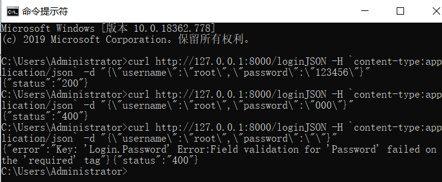

> 第一行是正常访问
>
> 第二行是密码错误
>
> 第三行是不按要求给password

用表单的方式

~~~go
type Login struct {
	// 接收json(或者form等)格式数据，binding表示username是必带的，否则报错
	Username string `json:"username" form:"username" uri:"username" binding:"required"`
	Password string `json:"password" form:"password" uri:"password"  binding:"required"`
}
func main()  {
	router := gin.Default()
	// json数据绑定
	router.POST("/loginForm", func(c *gin.Context) {
		// 用于接收数据的结构体
		var form Login
		// 反序列化进来肯定是传的地址 &，并判断是否报错
		if err := c.Bind(&form); err != nil{
			// 报错的时候用json返回，用gin.H（封装生产json数据的工具）
			c.JSON(http.StatusBadRequest, gin.H{"error":err.Error()})
		}
		// 数据到这，成功绑定到结构体，判断账户密码是否正确
		if form.Username != "root"||form.Password!="123456"{
			c.JSON(http.StatusUnauthorized, gin.H{"status":"400"})
			return
		}
		// 登录成功
		c.JSON(http.StatusOK, gin.H{"status":"200"})
	})
	// 跑起来
	_ = router.Run(":8000")
}
~~~

> 可以看到，表单的方式也只改了一点点，html用之前的就可以，记得struct添加form格式的

url的方式

~~~go
type Login struct {
	// 接收json(或者form等)格式数据，binding表示username是必带的，否则报错
	Username string `json:"username" form:"username" uri:"username" binding:"required"`
	Password string `json:"password" form:"password" uri:"password" binding:"required"`
}
func main()  {
	router := gin.Default()
	// URL数据绑定
	router.GET("/:username/:password", func(c *gin.Context) {
		// 用于接收数据的结构体
		var login Login
		// 反序列化进来肯定是传的地址 &，并判断是否报错
		if err := c.ShouldBindUri(&login); err != nil{
			// 报错的时候用json返回，用gin.H（封装生产json数据的工具）
			c.JSON(http.StatusBadRequest, gin.H{"error":err.Error()})
		}
		// 数据到这，成功绑定到结构体，判断账户密码是否正确
		if login.Username != "root"||login.Password!="123456"{
			c.JSON(http.StatusUnauthorized, gin.H{"status":"400"})
			return
		}
		// 登录成功
		c.JSON(http.StatusOK, gin.H{"status":"200"})
	})
	// 跑起来
	_ = router.Run(":8000")
}
~~~

> 启动然后去cmd访问 curl http://127.0.0.1:8000/root/123456

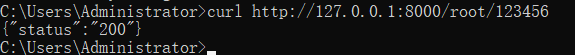

成功

**protobuf效率很高，因为是二进制传输**

### gin中间件

~~~go
package main

import (
	"fmt"
	"github.com/gin-gonic/gin"
	"net/http"
	"time"
)

// 定义中间件函数，所有请求前，都会执行这个函数
func Middleware()gin.HandlerFunc  {
	return func(c *gin.Context) {
		t1 := time.Now()
		fmt.Println("中间件开始执行")
		// 给context里设置一个参数
		c.Set("request", "中间件")
		// 1.Next()之前的代码最先执行
		// 2.Next()是执行所有路由的函数
		// 3.Next()之后的代码之后运行
		c.Next()
		status := c.Writer.Status()
		fmt.Println("中间件执行完成", status)
		t2 := time.Since(t1)
		fmt.Println("time:", t2)
	}
}
func main()  {
	router := gin.Default()
	// 注册中间件
	router.Use(Middleware())
	router.GET("/middleware", func(c *gin.Context) {
		// 取上下文中的值
		value, _ := c.Get("request")
		// 返回页面
		c.JSON(http.StatusOK, gin.H{"request":value})
	})
    // 局部中间件使用方法
	router.GET("/middleware2", Middleware(), func(c *gin.Context) {
		value, _ := c.Get("request")
		c.JSON(http.StatusOK, gin.H{"request":value})
	})

	_ = router.Run(":8000")
}
~~~

访问

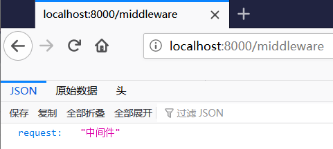

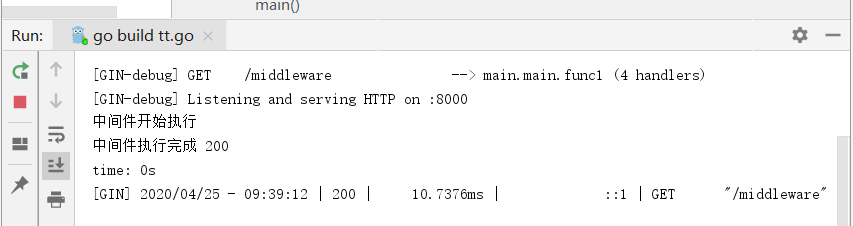

> 也就是开始跑的之前会先执行中间件

