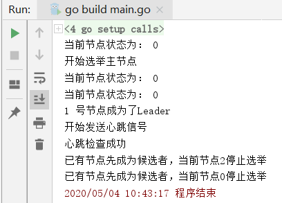

# 分布式系统Raft算法简单实现

算法动画http://thesecretlivesofdata.com/raft/

原理：每个节点一开始都是Follower，请求Leader节点，如果没有会在各自的随机时间（150ms~300ms）结束后变成Candidate，而后想其它节点发起投票推荐为Leader，票数最高则当选Leader。而当客户端发送数据过来会先记录在Leader的log上但未提交，它会将该数据复制给Followers，直大多数节点都记录起来，这时Leader才会提交该数据并通知其它Followers提交该数据。

注意点：

- 有可能有多个node随机时间一致都变成Candidate，那么就都发起投票，最高者成为Leader；
- 有可能多个Candidate平票，平票后这些Candidate会再进入随机时间，谁先到时间，谁就成为Candidate，发起投票，直至选出Leader；
- 如果出现分隔的集群合并，那么谁的Follower多谁就成为新的Leader，如果平，则又进入随机时间；

### 实现效果

> 最终只有一个节点成为leader