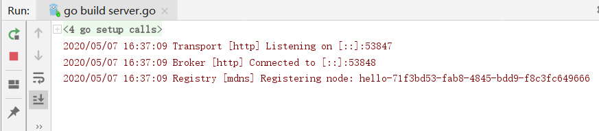
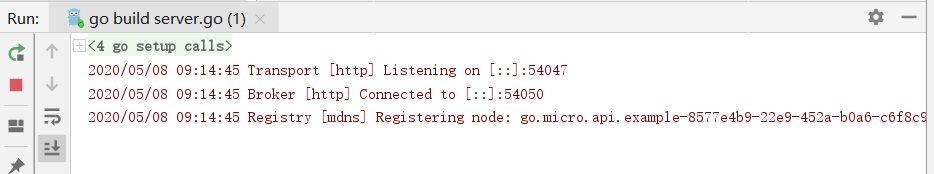
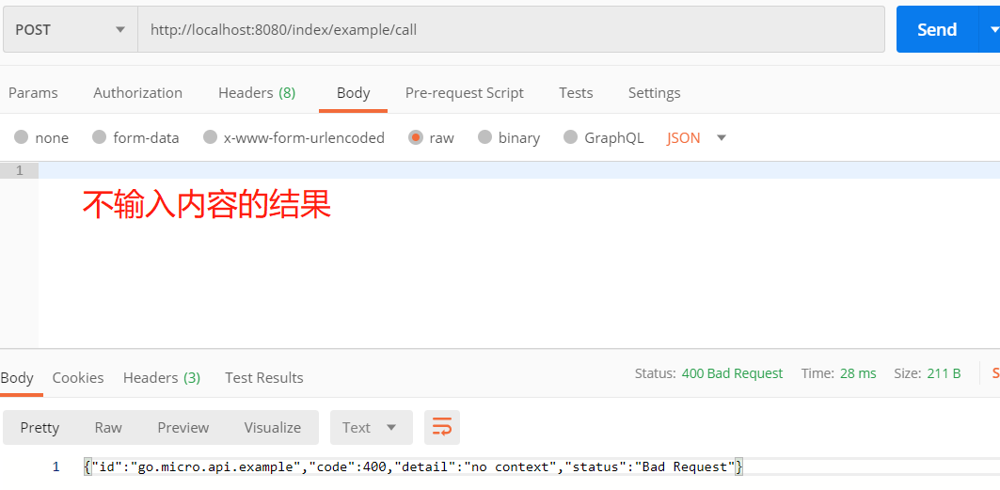

# Go-Micro

### 简介

- 是一个插件化的基础框架，基于此可以构建微服务，Micro的设计哲学是可插拔的插件化架构

  > 插件化：导入就用，不导入就不用

- 在架构之外，它默认实现了consul作为服务发现（2019年修改成默认mdns），通过http进行通信，通过protobuf和json进行编解码

### 主要功能

- 服务发现：自动服务注册和名称解析。
- 负载均衡：基于服务发现构建的客户端负载均衡。
- 消息编码：基于内容类型的动态消息编码。
- 请求响应：基于RPC的请求/响应，支持双向流。
- 异步通信
- 可插拔接口

### 写一个Hello

编写流程：hello.proto——生成go文件——编写server.go——启动（如下图）

编写完成后启动

cmd访问（如下）

> 先在cmd输入micro回车，确保是有的
>
> 

~~~
micro call hello Hello.Info {\"username\":\"ben\"}
~~~

> mac下可能不需要反斜杠转义，win是需要的

**成功**

### micro-http形式

> 外部http访问，在内部会转成rpc的形式

编写流程：api.proto——生成go文件——编写server.go——启动（如下图）

编写完后，先运行cmd，输入指令

再右键启动server.go

打开postman进行模拟访问

访问第一个方法

访问第二个方法

**成功**

### 微服务综合案例

go-micro开发电影院在线购票系统

1. #### 业务分析

   - 用户服务
   - 电影服务
   - 订单服务
   - 用户评论服务

2. #### 项目分析

   - 先做基本功能，用户服务的增删改查
   - demo
     - proto
     - src：源码
       - user-srv：用户服务
         - entity：定义用户的实体类
         - db：操作数据库，运行增删改查
         - handler：调用操作db的方法
         - main：程序的入口
       - share：公共服务
       - vendor：存放第三方库
       - dbhepler：数据库操作
         - db：建表添加假数据
       - api-srv：微服务的网关，统一处理请求

3. #### 开始搭建

运行cmd

~~~
consul agent -dev
~~~

> 可以看到开启的http端口是8500，我们去访问它访问网页

运行server的main

运行网关的main

> 启动完后那个8500端口的consul网页会自动注册了服务，可以看下

postman使用添加方法

数据库也有数据

尝试其它方法

修改

查询

删除

**全部成功**

